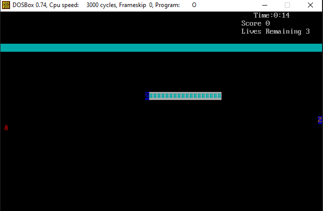
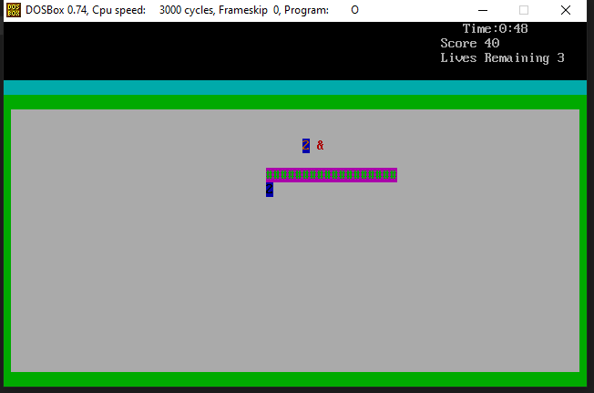
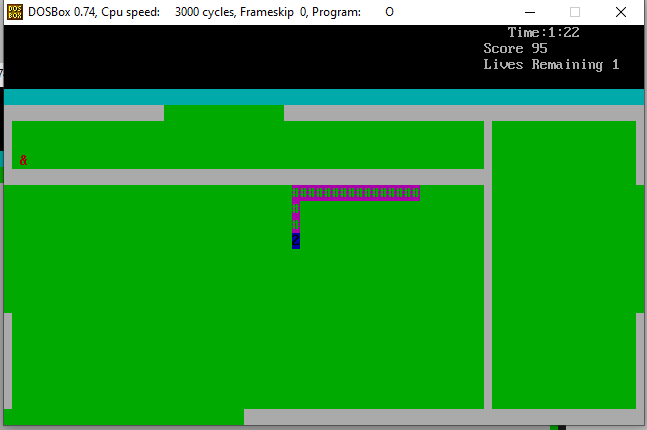

[![Contributors][contributors-shield]][contributors-url]
[![Forks][forks-shield]][forks-url]
[![Stargazers][stars-shield]][stars-url]
[![Issues][issues-shield]][issues-url]
[![MIT License][license-shield]][license-url]
[![LinkedIn][linkedin-shield]][linkedin-url]


<!-- PROJECT LOGO -->
<br />

<h1 style="font-size:100px" align="center">𓆚</h1>

  <h3 align="center">Snake game - Assembly Implementation</h3>

  <p align="center">
    An implementation on the snake game in assembly but with Dark Souls soundtrack ♫ implementated as frequencies using context switching because why not. This project can serve as a nice example for anyone looking to dabble in Assembly.
    <br />
    <br />
    <a href="https://github.com/Cyna298/Path-Finding-A-star">View Demo</a>
    ·
    <a href="https://github.com/Cyna298/Path-Finding-A-star/issues">Report Bug</a>
    ·
    <a href="https://github.com/Cyna298/Path-Finding-A-star/issues">Request Feature</a>
  </p>
</p>


<!-- TABLE OF CONTENTS -->
<details open="open">
  <summary><h2 style="display: inline-block">Table of Contents</h2></summary>
  <ol>
    <li>
      <a href="#about-the-project">About The Project</a>
      <ul>
        <li><a href="#built-with">Built With</a></li>
      </ul>
    </li>
    <li>
      <a href="#getting-started">Getting Started</a>
      <ul>
        <li><a href="#prerequisites">Prerequisites</a></li>
      </ul>
    </li>
    <li><a href="#usage">Usage</a></li>
    <li><a href="#contributing">Contributing</a></li>
    <li><a href="#license">License</a></li>
    
  </ol>
</details>


<!-- ABOUT THE PROJECT -->
## About The Project


### Built With

* [Assembly](https://www.nasm.us/)


<!-- GETTING STARTED -->
## Getting Started

To get the code up and running follow these simple steps.

### Prerequisites

First you would need to download and setup DOSBox. This is what I have used, you can use any other emulator or environment
* DOSBox
  ```sh
  https://www.dosbox.com/
  ```


<!-- USAGE EXAMPLES -->
## Usage

* Open [DOSBox](https://www.dosbox.com/)
* After the command line terminal is open. Mount the directory with the [snake.asm](snake.asm) file
  ```sh
  mount c: d:\folder\
  ```
  where d:\folder contains the [snake.asm](snake.asm) file

* Change the current working direction by entering whichever directory you have mounted. IN my case its c:
  ```sh
    c:
    ```

* Next, compile the file using the [nasm](https://www.nasm.us/) assembler already present in DOSbox
  ```sh
  nasm snake.asm -o Out.COM
  ```
  Out.COM is the produced file

* Now just run the file by entering the file name (ﾉ◕ヮ◕)ﾉ*:･ﾟ✧
  ```sh
  Out
  ```

  

  

  


<!-- CONTRIBUTING -->
## Contributing

Contributions are what make the open source community such an amazing place to be learn, inspire, and create. Any contributions you make are **greatly appreciated**.

1. Fork the Project
2. Create your Feature Branch (`git checkout -b feature/AmazingFeature`)
3. Commit your Changes (`git commit -m 'Add some AmazingFeature'`)
4. Push to the Branch (`git push origin feature/AmazingFeature`)
5. Open a Pull Request


<!-- LICENSE -->
## License

Distributed under the MIT License. See `LICENSE` for more information.


<!-- MARKDOWN LINKS & IMAGES -->
<!-- https://www.markdownguide.org/basic-syntax/#reference-style-links -->
[contributors-shield]: https://img.shields.io/github/contributors/Cyna298/Path-Finding-A-star.svg?style=for-the-badge
[contributors-url]: https://github.com/Cyna298/Path-Finding-A-star/graphs/contributors
[forks-shield]: https://img.shields.io/github/forks/Cyna298/Path-Finding-A-star.svg?style=for-the-badge
[forks-url]: https://github.com/Cyna298/Path-Finding-A-star/network/members
[stars-shield]: https://img.shields.io/github/stars/Cyna298/Path-Finding-A-star.svg?style=for-the-badge
[stars-url]: https://github.com/Cyna298/Path-Finding-A-star/stargazers
[issues-shield]: https://img.shields.io/github/issues/Cyna298/Path-Finding-A-star.svg?style=for-the-badge
[issues-url]: https://github.com/Cyna298/Path-Finding-A-star/issues
[license-shield]: https://img.shields.io/github/license/Cyna298/Path-Finding-A-star.svg?style=for-the-badge
[license-url]: https://github.com/Cyna298/Path-Finding-A-star/blob/master/LICENSE.txt
[linkedin-shield]: https://img.shields.io/badge/-LinkedIn-black.svg?style=for-the-badge&logo=linkedin&colorB=555
[linkedin-url]: https://www.linkedin.com/in/mubariz-barkat-ali-0a8b86191/
